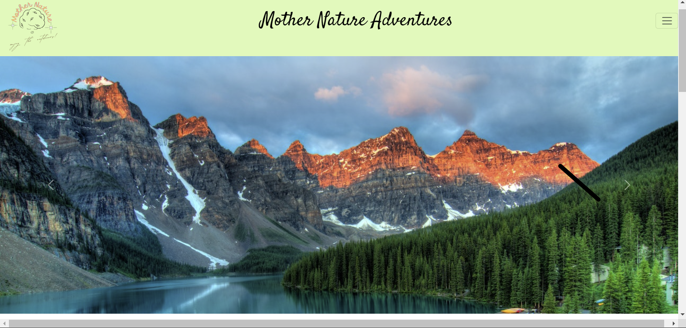
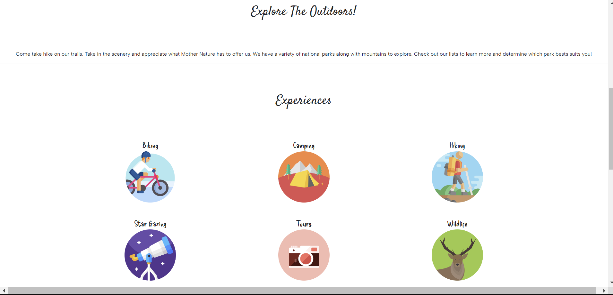
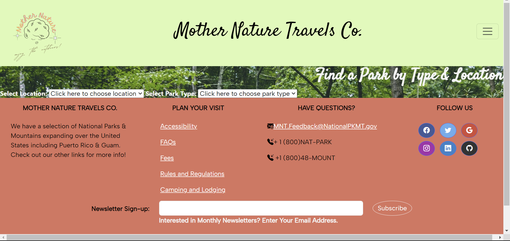
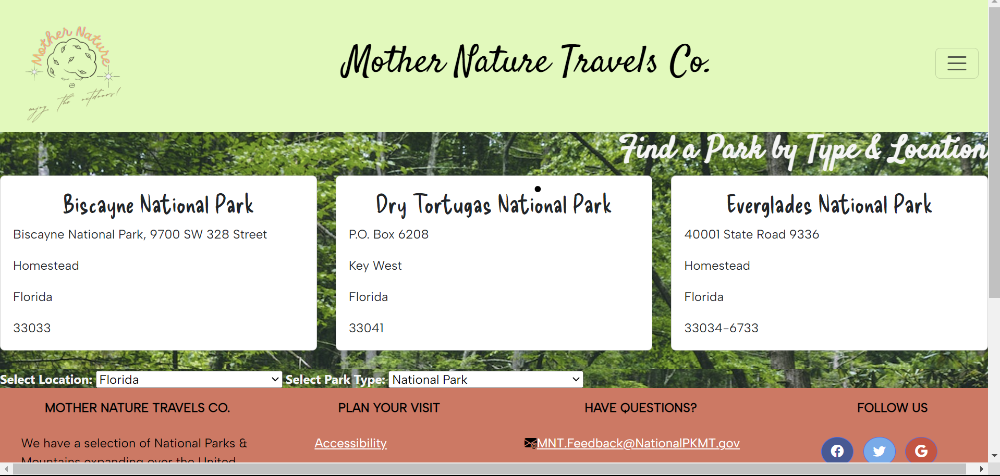
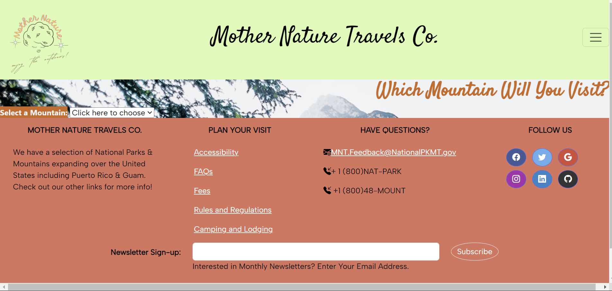
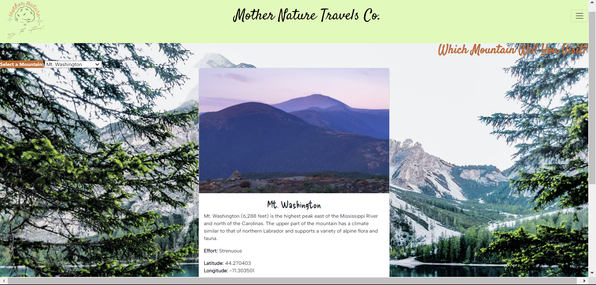

# capstone--enjoytheoutdoors

I created a travel agency called Mother Nature Adventures that assists users by providing information over several mountains and national parks. This project consists of three pages: index, national park, and mountains.

The index provides navbar to guide in all 3 pages, a carousel of 4 pictures depicting mountains and national parks from pexel.com, brief description of the page, experiences and amenities, and a footer with social media icons, additional info links, and an email form-control that allows the user to enter email to suscribe to a newsletter which will prompt a message when the submit button is clicked.

The mountains and national parks pages have the same navbar and footer as the index.

The national parks page consists of two dropdowns in which the user can find a park by slecting the location (state) and park type (national park, trail, historic, etc.) The user must select a state first to populate search results. When prompted, the park information will display on a bootstrap card with the park name and address (street name, city, state, and zip code). Eventually, the phone number and visit link will be included in the cards. The background image is a forest.

The mountains page has a dropdown of several mountains found in the US. When a mountain is selected, a bootstrap card will appear with the mountain image, name, description, elevation, latitude, and longitude coordinates. The background image consists of a mountain as well.

The most interesting thing in this project was finding out that I knew more about Javascript than I originally thpught. This was a real learnign experience because I was learning as I was trying to figure out how to code the Javascript functions. When I took the assessment, I realized that I knew more than half of the answers on my own. At the same time, this has been the most challenging because I had been struggling to understand and implement Javascript. Thankfully, with the help of my peers and intructor, I was able to finish this project successfully.

Preview:

Index: 

National Parks: 

Mountains: 

